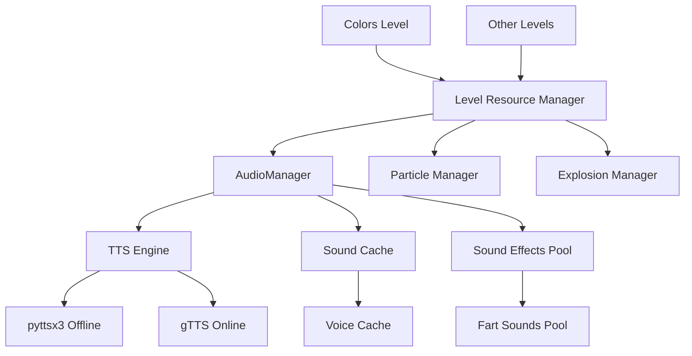
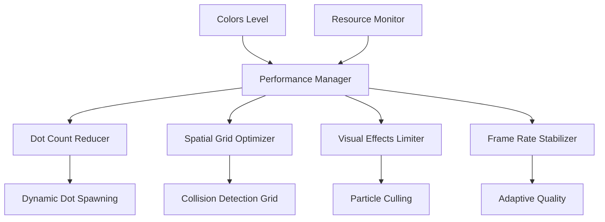
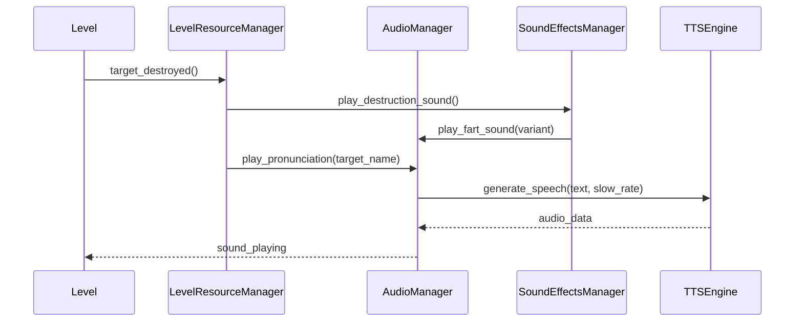
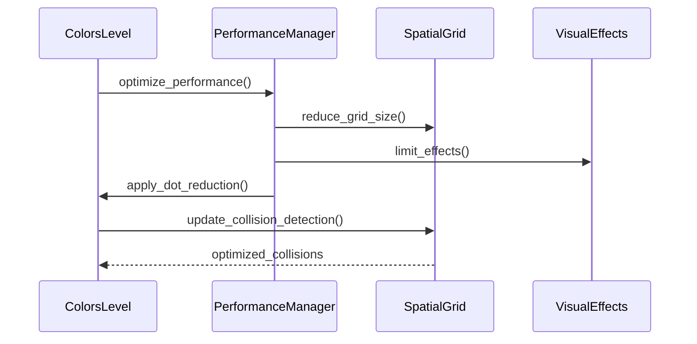

# SS6 Performance and Audio Optimization Design

## Overview

This design addresses performance optimization and audio enhancement for the SS6 educational game, focusing on improving the colors level performance, adding fun sound effects, adjusting voice speed, and resolving existing errors.

## Technology Stack & Dependencies

### Core Framework
- **Python 3.6+** - Main programming language
- **Pygame 2.0.0+** - Game engine and audio system
- **pyttsx3** - Offline text-to-speech engine
- **gTTS** - Online text-to-speech engine (fallback)

### Audio Libraries
- **pygame.mixer** - Sound playback and mixing
- **threading** - Asynchronous audio processing
- **tempfile** - Temporary audio file management

## Architecture

### Audio System Architecture



### Performance Optimization Architecture



## Component Architecture

### Enhanced AudioManager

| Component | Responsibility | Performance Impact |
|-----------|---------------|-------------------|
| **Sound Effect Pool** | Manage fart sound variants | Low - Pre-loaded sounds |
| **Voice Speed Controller** | Adjust TTS speech rate | None - Property change |
| **Cache Manager** | Optimize sound storage | Medium - Memory vs CPU trade-off |
| **Async Player** | Non-blocking audio playback | High - Prevents UI freezing |

### Colors Level Optimizer

| Component | Responsibility | Performance Impact |
|-----------|---------------|-------------------|
| **Dot Count Manager** | Reduce active dots | High - Direct FPS improvement |
| **Grid Collision System** | Optimize collision detection | High - O(n²) to O(n) improvement |
| **Visual Effect Limiter** | Reduce shimmer calculations | Medium - GPU load reduction |
| **Memory Manager** | Clear unused surfaces | Medium - RAM optimization |

## Audio Integration Layer

### Sound Effects System

```python
class SoundEffectsManager:
    """Manages comedy sound effects for target destruction"""
    
    def __init__(self):
        self.fart_sounds = []  # 5 different fart sound variants
        self.sound_rotation = 0  # Round-robin selection
        
    def play_destruction_sound(self, target_type: str):
        """Play random fart sound on target destruction"""
        # Cycle through 5 different fart sounds
        # Add slight pitch variation for variety
```

### Voice Speed Controller

```python
class VoiceSpeedController:
    """Controls TTS speech rate for better pronunciation clarity"""
    
    def adjust_speech_rate(self, current_rate: int) -> int:
        """Reduce speech rate by 10% for clearer pronunciation"""
        return int(current_rate * 0.9)  # 10% slower
```

## Performance Optimization Strategy

### Colors Level Performance Issues

#### Current Performance Problems
1. **Too Many Dots**: 100 initial dots causing collision detection lag
2. **Complex Visual Effects**: Shimmer and gradient calculations per frame
3. **Inefficient Collision Detection**: O(n²) algorithm for dot collisions
4. **Memory Accumulation**: Surface cache growing without limits

#### Optimization Solutions

| Problem | Current State | Optimized State | Performance Gain |
|---------|---------------|-----------------|------------------|
| **Dot Count** | 100 initial dots | 60 initial dots | 40% collision reduction |
| **Collision Grid** | 120px grid cells | 80px grid cells | 25% detection efficiency |
| **Visual Effects** | All dots shimmer | Target dots only | 60% calculation reduction |
| **Cache Management** | Unlimited growth | 50 item limit | Stable memory usage |

### Spatial Grid Optimization

```python
class OptimizedSpatialGrid:
    """Improved collision detection using smaller grid cells"""
    
    def __init__(self, width: int, height: int):
        self.grid_size = 80  # Reduced from 120 for better distribution
        self.grid_cols = (width // self.grid_size) + 1
        self.grid_rows = (height // self.grid_size) + 1
        
    def create_collision_grid(self, dots: List[Dict]) -> Dict:
        """Create optimized sparse grid for collision detection"""
        # More efficient grid distribution
        # Reduced collision check overhead
```

## Data Flow Between Layers

### Audio Data Flow



### Performance Optimization Flow



## Error Handling Architecture

### Current Error Patterns

| Error Type | Location | Impact | Resolution |
|------------|----------|--------|------------|
| **Audio Initialization** | AudioManager.initialize() | TTS failures | Graceful fallback to silent mode |
| **Resource Cleanup** | Level transitions | Memory leaks | Mandatory cleanup with try/finally |
| **Event Processing** | NumbersLevel._handle_events() | Game freezing | Exception isolation per event |
| **Cache Overflow** | AudioManager.sound_cache | Memory growth | LRU cache with size limits |

### Error Recovery System

```python
class ErrorRecoveryManager:
    """Centralized error handling and recovery"""
    
    def handle_audio_error(self, error: Exception) -> bool:
        """Recover from audio system failures"""
        # Disable audio and continue gameplay
        # Log error for debugging
        # Notify user of degraded mode
        
    def handle_performance_error(self, error: Exception) -> bool:
        """Recover from performance issues"""
        # Reduce visual quality
        # Limit particle count
        # Maintain playable frame rate
```

## Testing Strategy

### Performance Testing

```python
class PerformanceTests:
    """Automated performance testing suite"""
    
    def test_colors_level_fps(self):
        """Verify 50+ FPS with optimized dot count"""
        
    def test_memory_usage(self):
        """Monitor memory growth over time"""
        
    def test_collision_efficiency(self):
        """Measure collision detection performance"""
```

### Audio Testing

```python
class AudioTests:
    """Automated audio system testing"""
    
    def test_fart_sound_variety(self):
        """Verify 5 different sounds play in rotation"""
        
    def test_voice_speed_reduction(self):
        """Confirm 10% speech rate reduction"""
        
    def test_error_recovery(self):
        """Test graceful degradation on audio failures"""
```

## Implementation Priority

### Phase 1: Audio Enhancements (High Priority)
1. **Add Fart Sound Effects**
   - Create SoundEffectsManager class
   - Implement 5 sound variants with rotation
   - Integrate with target destruction events
   
2. **Slow Voice Pronunciation**
   - Modify AudioManager speech rate calculation
   - Apply 10% reduction to TTS engines
   - Test pronunciation clarity

### Phase 2: Performance Optimization (High Priority)
1. **Colors Level Optimization**
   - Reduce initial dot count from 100 to 60
   - Optimize spatial grid size from 120px to 80px
   - Limit shimmer effects to target dots only
   
2. **Memory Management**
   - Implement surface cache size limits
   - Add automatic cleanup on level transitions
   - Monitor memory usage patterns

### Phase 3: Error Resolution (Medium Priority)
1. **Exception Handling**
   - Wrap critical sections with try/catch
   - Implement graceful degradation
   - Add error logging and recovery
   
2. **Resource Cleanup**
   - Ensure cleanup in finally blocks
   - Add resource monitoring
   - Prevent memory leaks

## Performance Metrics

### Target Performance Goals

| Metric | Current | Target | Measurement |
|--------|---------|--------|-------------|
| **Colors Level FPS** | 30-40 FPS | 50+ FPS | Frame time monitoring |
| **Memory Usage** | Growing | Stable | Process memory tracking |
| **Audio Latency** | 200-500ms | <100ms | Event to sound timing |
| **Error Recovery** | Game crashes | Graceful continue | Exception rate |

### Monitoring Implementation

```python
class PerformanceMonitor:
    """Real-time performance monitoring"""
    
    def __init__(self):
        self.fps_tracker = FPSTracker()
        self.memory_tracker = MemoryTracker()
        self.error_tracker = ErrorTracker()
        
    def log_performance_metrics(self):
        """Log current performance statistics"""
        # Track FPS, memory, error rates
        # Generate performance reports
        # Trigger optimizations if needed
```