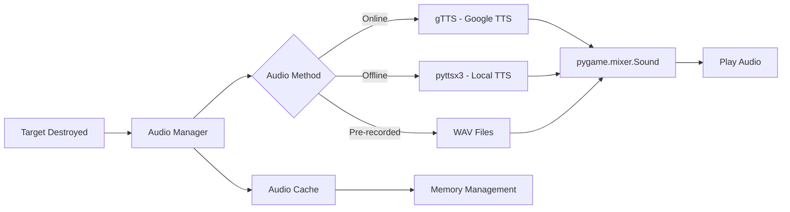
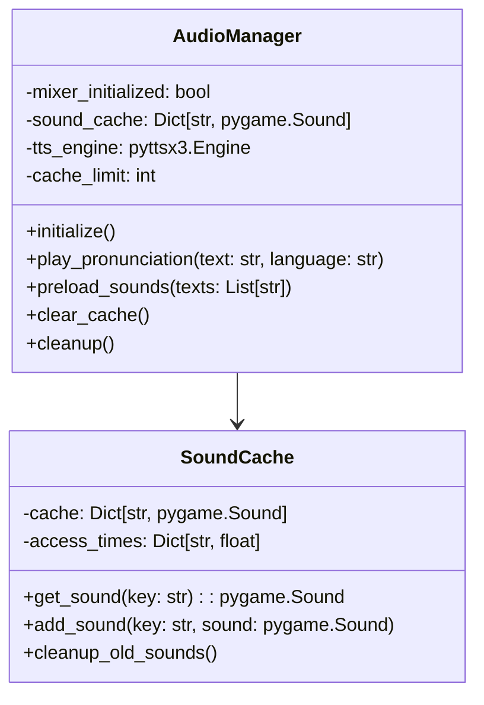
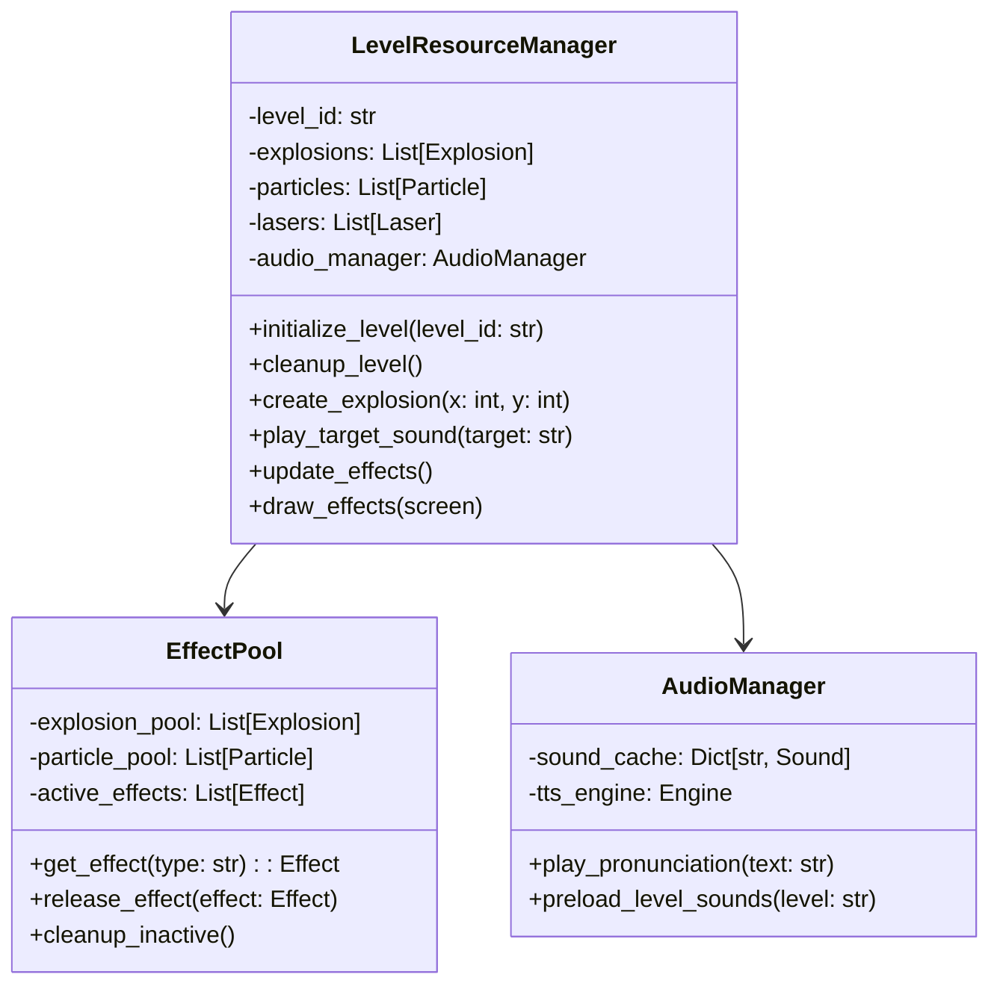
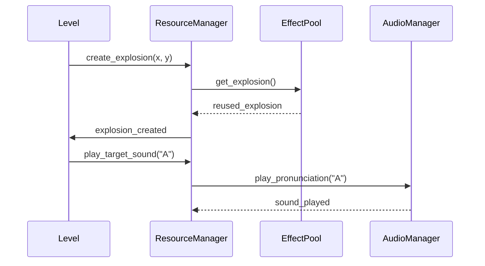

# Target Explosion Synchronization and Voice Enhancement Design

## Overview

This design addresses two critical issues in the SS6 educational game:
1. **Voice/Sound Enhancement**: Adding voice pronunciation for targets when destroyed to improve learning outcomes
2. **Multi-Level Instance Isolation**: Preventing explosion effects and resources from bleeding across multiple level instances, causing performance degradation and visual artifacts

The solution focuses on proper resource management, audio integration, and level state isolation to ensure each game mode runs independently without interference.

## Problem Analysis

### Current Issues Identified

#### 1. Multi-Level Instance Conflicts
- **Global Resource Sharing**: Explosions, particles, and effects are managed globally in `SS6.origional.py`
- **Resource Bleeding**: Effects from one level persist when switching to another level
- **Memory Accumulation**: Particles and explosions accumulate without proper cleanup
- **Performance Degradation**: Multiple active particle systems cause frame rate drops

#### 2. Missing Audio Feedback
- **No Pronunciation**: No audio feedback when targets are destroyed
- **Limited Learning Support**: Visual-only feedback reduces educational effectiveness
- **Missing Audio System**: No pygame.mixer initialization or sound management

### Architecture Analysis

```mermaid
graph TD
    A[SS6.origional.py - Main Game Loop] --> B[Global Resources]
    B --> C[explosions[]]
    B --> D[particles[]]
    B --> E[lasers[]]
    B --> F[particle_manager]
    
    A --> G[Level Classes]
    G --> H[AlphabetLevel]
    G --> I[NumbersLevel]
    G --> J[ShapesLevel]
    G --> K[ColorsLevel]
    G --> L[CLCaseLevel]
    
    H --> B
    I --> B
    J --> B
    K --> B
    L --> B
    
    style B fill:#ff9999
    style C fill:#ff9999
    style D fill:#ff9999
    style E fill:#ff9999
```

**Issue**: All levels share the same global resource pools, leading to cross-contamination.

## Audio System Architecture

### Text-to-Speech Integration



### Audio Manager Class Design



## Level Isolation Architecture

### Current vs Proposed Resource Management

```mermaid
graph TD
    subgraph "Current (Problematic)"
        A1[Level A] --> G1[Global explosions[]]
        A2[Level B] --> G1
        A3[Level C] --> G1
        G1 --> P1[Performance Issues]
    end
    
    subgraph "Proposed (Isolated)"
        B1[Level A] --> L1[Level A Resources]
        B2[Level B] --> L2[Level B Resources]
        B3[Level C] --> L3[Level C Resources]
        
        L1 --> M1[Resource Manager]
        L2 --> M1
        L3 --> M1
        M1 --> P2[Controlled Performance]
    end
```

### Level Resource Manager



## Implementation Strategy

### Phase 1: Audio System Implementation

#### Audio Manager Component
```python
# Pseudo-implementation structure
class AudioManager:
    def __init__(self):
        self.mixer_initialized = False
        self.sound_cache = {}
        self.tts_engine = None
        
    def initialize(self):
        # Initialize pygame.mixer
        # Initialize TTS engine
        # Set up audio format
        
    def play_pronunciation(self, text, language="en"):
        # Check cache first
        # Generate TTS if not cached
        # Play through pygame.mixer
```

#### Level Integration Points
- **Target Destruction**: Trigger audio when correct target hit
- **Level Start**: Announce level type and first target
- **Group Completion**: Audio feedback for progress
- **Error Feedback**: Audio cues for incorrect selections

### Phase 2: Resource Isolation

#### Level Resource Encapsulation
```python
# Pseudo-implementation structure  
class LevelResourceManager:
    def __init__(self, level_id):
        self.level_id = level_id
        self.explosions = []
        self.particles = []
        self.audio_manager = AudioManager()
        
    def cleanup(self):
        # Clean all level-specific resources
        # Clear audio cache
        # Reset effect pools
```

#### Refactoring Strategy
1. **Extract Global Resources**: Move shared resources to ResourceManager
2. **Level-Specific Initialization**: Each level creates its own resource manager
3. **Cleanup Enforcement**: Mandatory cleanup when level exits
4. **Resource Limits**: Per-level limits on effects and memory usage

### Phase 3: Performance Optimization

#### Effect Pooling System


#### Memory Management Strategy
- **Object Pooling**: Pre-allocated particle and explosion objects
- **Automatic Cleanup**: Timer-based cleanup of old effects  
- **Cache Limits**: Maximum cached audio files per level
- **Garbage Collection**: Explicit cleanup between level transitions

## Testing Strategy

### Functional Testing
- **Audio Playback**: Verify all targets have correct pronunciation
- **Level Isolation**: Ensure no effect bleeding between levels
- **Performance**: Measure FPS under heavy effect load
- **Memory**: Monitor memory usage during extended gameplay

### Integration Testing
- **Level Transitions**: Test resource cleanup during level changes
- **Audio Caching**: Verify cache limits and cleanup behavior
- **Cross-Platform**: Test audio on different operating systems
- **Hardware Compatibility**: Test on various audio hardware configurations

### Performance Benchmarks
- **Effect Limits**: Maximum simultaneous effects per level
- **Audio Latency**: Time from target hit to audio playback
- **Memory Usage**: Peak memory consumption per level
- **Frame Rate**: Minimum acceptable FPS under load

## Dependencies and Requirements

### New Dependencies
```python
# requirements.txt additions
pyttsx3>=2.90        # Offline TTS engine
gtts>=2.3.0          # Google Text-to-Speech (optional)
requests>=2.28.0     # For online TTS services
```

### Audio File Management
```
assets/
├── audio/
│   ├── alphabet/
│   │   ├── a.wav
│   │   ├── b.wav
│   │   └── ...
│   ├── numbers/
│   │   ├── one.wav
│   │   ├── two.wav
│   │   └── ...
│   ├── shapes/
│   │   ├── circle.wav
│   │   ├── square.wav
│   │   └── ...
│   └── colors/
│       ├── red.wav
│       ├── blue.wav
│       └── ...
```

### Configuration Options
```python
# Audio settings in settings.py
AUDIO_SETTINGS = {
    "enabled": True,
    "tts_method": "offline",  # "offline", "online", "prerecorded"
    "language": "en",
    "speech_rate": 150,
    "volume": 0.8,
    "cache_limit": 50
}
```

## Migration Plan

### Phase 1: Audio Foundation (Week 1)
1. Add pygame.mixer initialization to main game
2. Implement basic AudioManager class
3. Add TTS library integration (pyttsx3)
4. Create audio asset directory structure

### Phase 2: Level Integration (Week 2)  
1. Integrate AudioManager into each level class
2. Add pronunciation calls at target destruction points
3. Implement audio caching system
4. Add configuration options for audio settings

### Phase 3: Resource Isolation (Week 3)
1. Create LevelResourceManager class
2. Refactor global resource management
3. Implement per-level effect pools
4. Add cleanup enforcement

### Phase 4: Testing and Optimization (Week 4)
1. Performance testing and optimization
2. Cross-platform audio testing
3. Memory leak detection and fixes
4. User acceptance testing

## Risk Mitigation

### Audio System Risks
- **TTS Availability**: Provide fallback to pre-recorded files
- **Audio Hardware**: Graceful degradation when audio unavailable
- **Performance Impact**: Asynchronous audio loading and caching
- **Language Support**: Modular language system for future expansion

### Resource Management Risks
- **Memory Leaks**: Comprehensive cleanup testing and monitoring
- **Performance Regression**: Benchmark before and after changes
- **Compatibility**: Maintain backward compatibility during migration
- **Complexity**: Incremental implementation to minimize risk

## Success Metrics

### Educational Effectiveness
- **Learning Improvement**: Measure pronunciation accuracy improvement
- **Engagement**: Track time spent in each level
- **User Feedback**: Collect feedback on audio clarity and usefulness

### Technical Performance  
- **Stability**: Zero crashes during level transitions
- **Performance**: Maintain 60 FPS under normal load
- **Memory**: No memory growth over extended sessions
- **Audio Quality**: Clear, synchronized pronunciation feedback