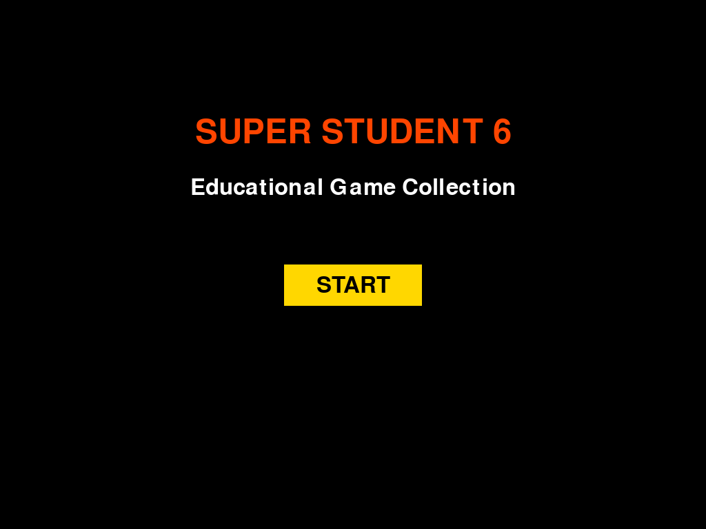
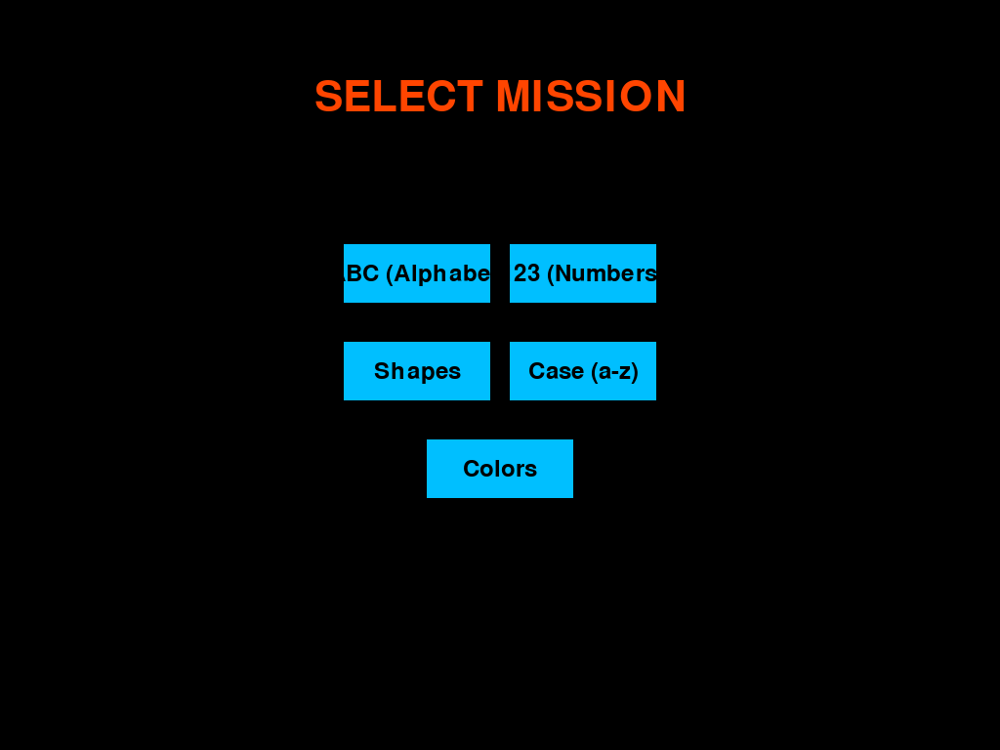
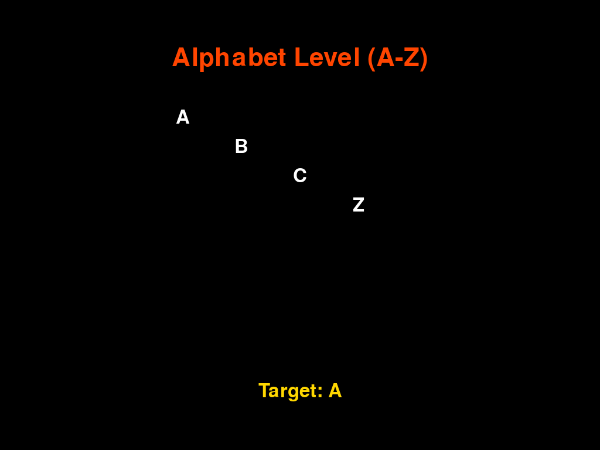
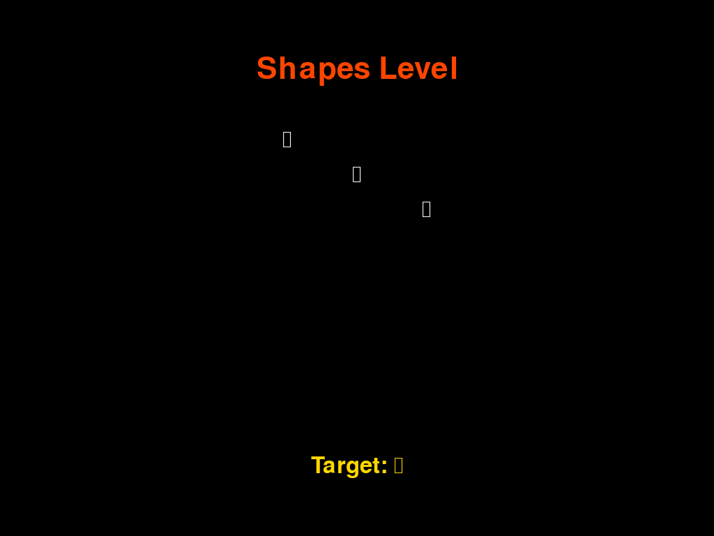
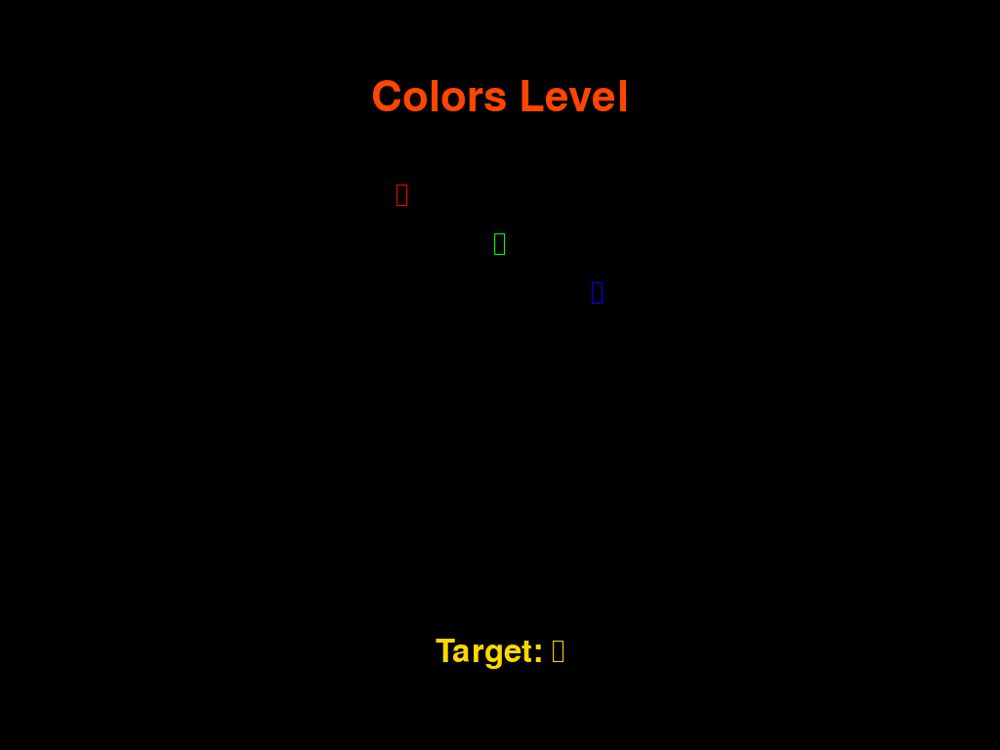
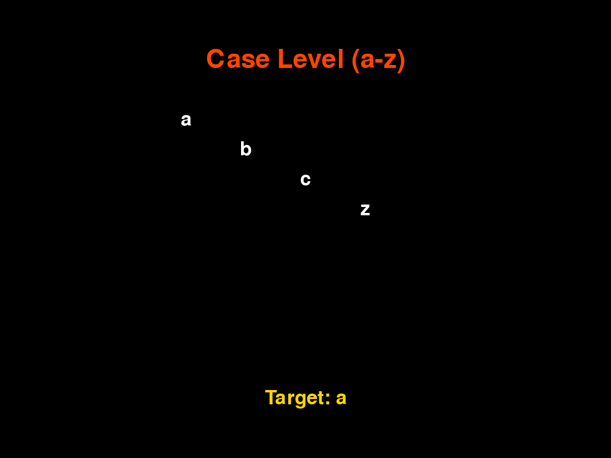

# SS6 - Super Student Game

A multi-level educational game featuring various learning modes including alphabet, numbers, shapes, colors, and case sensitivity training.

## Features

- **Multiple Game Modes:**
  - Alphabet (A-Z)
  - Numbers (1-10)
  - Shapes (Circle, Square, Triangle, Rectangle, Pentagon)
  - Colors (Interactive color matching)
  - Case Sensitivity (a-z)

- **Advanced Graphics:**
  - Particle effects and explosions
  - Glass shatter mechanics
  - Flamethrower effects
  - Multi-touch support
  - Fullscreen gameplay

- **Adaptive Display:**
  - Supports both standard monitors and QBoard displays
  - Auto-detection of display type
  - Scalable UI elements

## Screenshots

### Welcome Screen
The main welcome screen that greets players when starting the game.



### Level Selection Menu
Choose from five different educational game modes.



### Game Levels

#### Alphabet Level (A-Z)
Learn and practice the alphabet by clicking on falling letters.



#### Numbers Level (1-10)
Practice number recognition with falling number targets.


#### Shapes Level
Identify and match geometric shapes including circles, squares, triangles, rectangles, and pentagons.



#### Colors Level
Interactive color matching with bouncing colored dots and advanced physics.



#### Case Sensitivity Level (a-z)
Practice lowercase letter recognition and case sensitivity.



## Installation

### Quick Installation

1. **Run the installer:**
   ```bash
   python install.py
   ```
   
   The installer will:
   - Check Python version compatibility
   - Verify all game files are present
   - Install pygame dependency
   - Create a play script for easy game launching

### Manual Installation

1. **Install Python 3.6 or higher**
   - Download from [python.org](https://python.org)

2. **Install pygame:**
   ```bash
   pip install pygame
   ```
   
   Or using requirements.txt:
   ```bash
   pip install -r requirements.txt
   ```

## How to Play

### Using the Play Script (Recommended)
After running the installer:

**Windows:**
- Double-click `Play.bat`

**Linux/Mac:**
- Run `./Play.sh` in terminal

### Manual Launch
```bash
python SS6.origional.py
```

## Game Controls

- **Mouse/Touch:** Click on targets to destroy them
- **ESC:** Exit the game
- **Space:** Switch abilities (in applicable modes)

## Game Modes

### Alphabet Mode
- Target letters fall from the top
- Click the correct letter shown in the center
- Progress through A-Z in groups

### Numbers Mode
- Target numbers 1-10 fall from the top
- Click the correct number shown in the center
- Complete all numbers to finish

### Shapes Mode
- Geometric shapes fall from the top
- Click the shape matching the center target
- Two rounds of all shapes

### Colors Mode
- Colored dots bounce around the screen
- Click dots matching the target color
- Advanced physics and collision system

### Case Sensitivity Mode
- Lowercase letters fall from the top
- Click the correct letter (a-z)
- Special handling for Greek letters

## System Requirements

- **Python:** 3.6 or higher
- **Dependencies:** pygame 2.0.0+
- **Display:** Any resolution (auto-adapts)
- **Input:** Mouse, touch screen, or keyboard

## File Structure

```
SS6/
├── install.py              # Installation script
├── Play.bat/.sh           # Game launcher (created by installer)
├── requirements.txt        # Python dependencies
├── SS6.origional.py       # Main game file
├── settings.py            # Game configuration
├── universal_class.py     # Universal game classes
├── welcome_screen.py      # Welcome and menu screens
├── levels/                # Level-specific code
│   ├── __init__.py
│   ├── colors_level.py
│   └── shapes_level.py
└── utils/                 # Utility modules
    ├── __init__.py
    ├── particle_system.py
    └── resource_manager.py
```

## Troubleshooting

### Common Issues

1. **"pygame not found" error:**
   - Run the installer: `python install.py`
   - Or manually install: `pip install pygame`

2. **Game doesn't start:**
   - Check Python version: `python --version`
   - Ensure all files are present
   - Try running: `python SS6.origional.py`

3. **Display issues:**
   - The game auto-detects display type
   - Try different display modes in the welcome screen

4. **Performance issues:**
   - Close other applications
   - The game automatically adjusts particle counts
   - Lower resolution may help on older systems

### Getting Help

If you encounter issues:
1. Check that all game files are present
2. Verify pygame is installed correctly
3. Try running the installer again
4. Check the console for error messages

## Development

The game is built with a modular architecture:
- **Universal Classes:** Shared functionality across all levels
- **Level System:** Each game mode is a separate class
- **Resource Manager:** Handles fonts and display scaling
- **Particle System:** Manages visual effects

## Future Development

A detailed design document for porting the game to HTML, CSS, and JavaScript can be found in `SuperStudentHTML.md`. This document outlines the plan for a future web-based version of the game.

## License

This is an educational game project. Please respect any applicable licenses for the codebase and dependencies. 